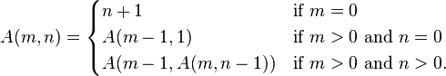

# Ackermann

## Matcom Online Grader
**Faculty of Mathematics and Computer Science of University of Havana**  
### Programación de Máquinas I

## A - Ackermann
**Time Limit:** 1 second(s)  
**Memory Limit:** 32 megabytes

### Navigation
- [Statement](#)
- [All Submissions](http://judge.matcom.uh.cu/asm/contest/XTRA/submissions/problem/A)
- [Accepted Submissions](http://judge.matcom.uh.cu/asm/contest/XTRA/submissions/problem/A/result/accepted)
- [Download PDF](http://judge.matcom.uh.cu/asm/problem/XTRAA/pdf)
- [Submit](http://judge.matcom.uh.cu/asm/contest/XTRA/submit/A)

---

El hijo del Sr. y la Sra. Smith no ha salido muy bien en la escuela, y está estudiando para sus exámenes de Matemática Discreta y Programación de Máquinas.  
Para tratar de aprovechar el poco tiempo que le queda decidió estudiar las dos asignaturas al mismo tiempo. Se le ocurrió que una buena manera de practicar para ambas pruebas sería programar la función de Ackermann.

Al abrir el libro se encontró con que la función está definida de la siguiente manera:

y como no entendió mucho decidió pedirte un poco de ayuda. Como eres buen amigo suyo, y has estudiado mucho más que él, has decidido ayudarlo.

### Input
Dos líneas:
1. Primera línea: m
2. Segunda línea: n

### Output
Una única línea con el valor de A(m,n)

### Sample test(s)

#### Input
3
2
#### Output
29
---

<footer>

© 2015 - MOG Version: 2.0.0.14

Grader Version: 2.0.0.22

Server Time: 12/1/2015 3:23:10 PM

</footer>